## Step 1: Create a Device Template in IoTConnect
* Navigate to https://awspoc.iotconnect.io/ and enter your account credentials.
   * This will bring you to your AWS IoTConnect Dashboard.
* On the far-left side of the screen is a navy-blue toolbar, hover your cursor over the icon that looks like a processor chip and choose “Device” out of the dropdown options (shown below). 

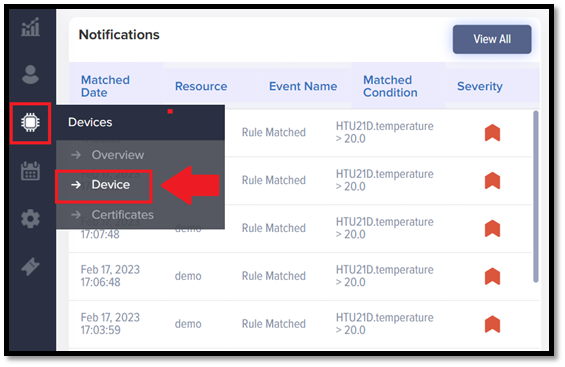

* On the toolbar at the bottom of the page, select the “Templates” tab.

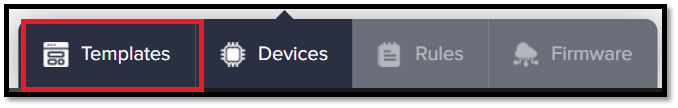

* On the Templates page, click the “Create Template” button in the top right corner of the screen. 

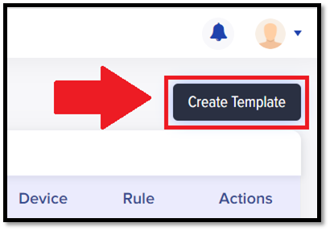

* Enter the following information into the Template creation page and click “Save”:

| Attribute              | Value                   |
| ---------------------- | ----------------------- |
| Template Code          | basic_demo              |
| Template Name          | BasicDemo              |
| Authentication Type    | Self Signed Certificate |
| Device Message Version | 2.1                     |

 **Note: if the device template already exists simply delete and recreate it.**

* Next, click on the “Attributes” tab below the information you just entered.

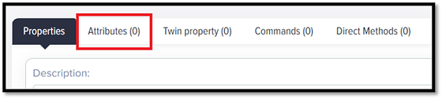
 
* Enter the following information and click “Save”:

| Attribute  | Value       |
| ---------- | ----------- |
| Local Name | data        |
| Data Type  | INTEGER     |

* Then, click on the "Properties" tab.

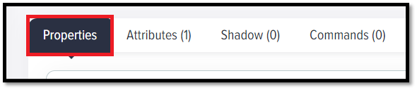

* Make sure the Data Frequency is set to 60 seconds, and click save.

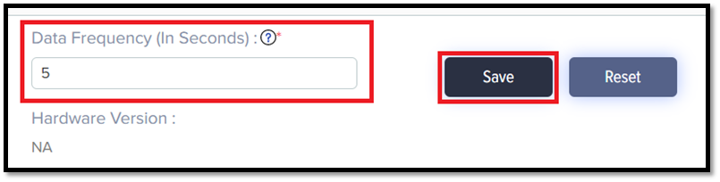

# Step 2: Create the Device in IoTConnect
* Navigate back to the “Device” menu and click on “Create Device” in the top right corner of the screen.

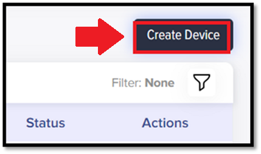

* Enter the following information and then click “Save and View”:
  
| Attribute    | Value         |
| ------------ | ------------- |
| Unique Id    | basic_demo    |
| Display Name | BasicDemo     |
| Entity       | Avnet         |
| Template     | basic_demo    |
 
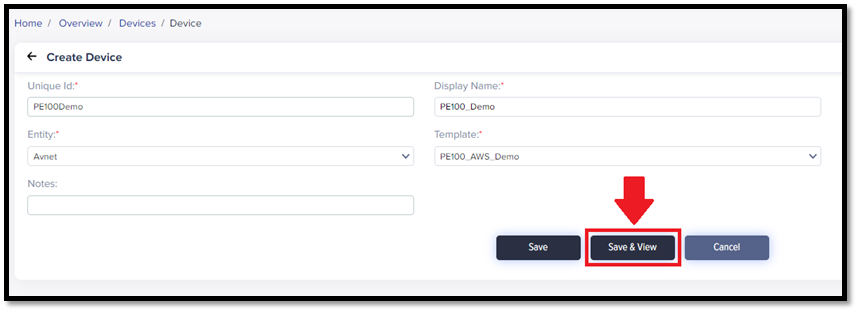

* In the resulting page, click “Connection Info” in the top-right corner of the page.

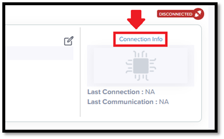

* Click on the yellow and green certificate icon in the top-right corner of the resulting pop-up to download the zipped certificate package called "basic_demo-certificates.”

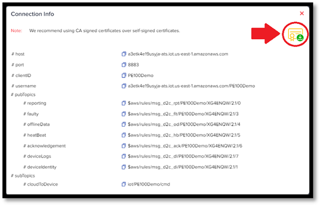

* Extract the certificate package folder and copy both certificate files into the certificate folder. The folder should include:
   * basic_demo.pem
   * basic_demo.crt

# Step 3: Run the Demo

Make sure you are in the basic_demo directory

`cd basic_demo/`

To run

`./run.sh`  

# Step 4: View data on IoTConnect

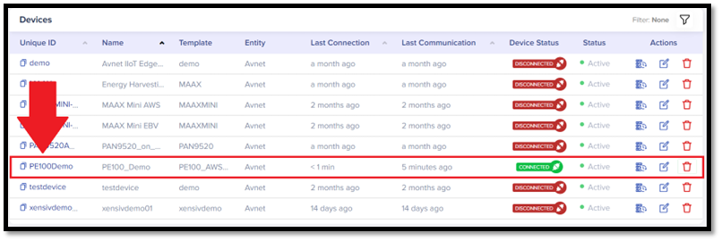

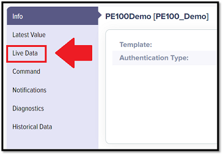

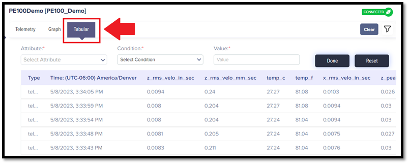